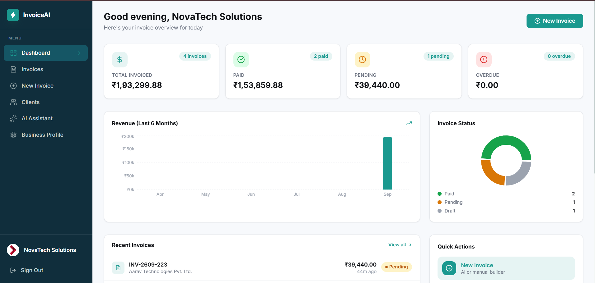
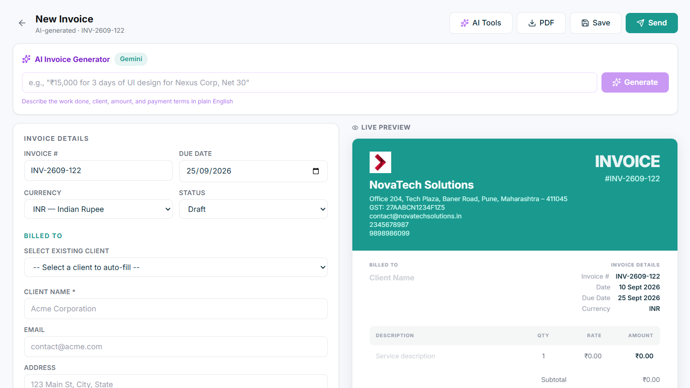
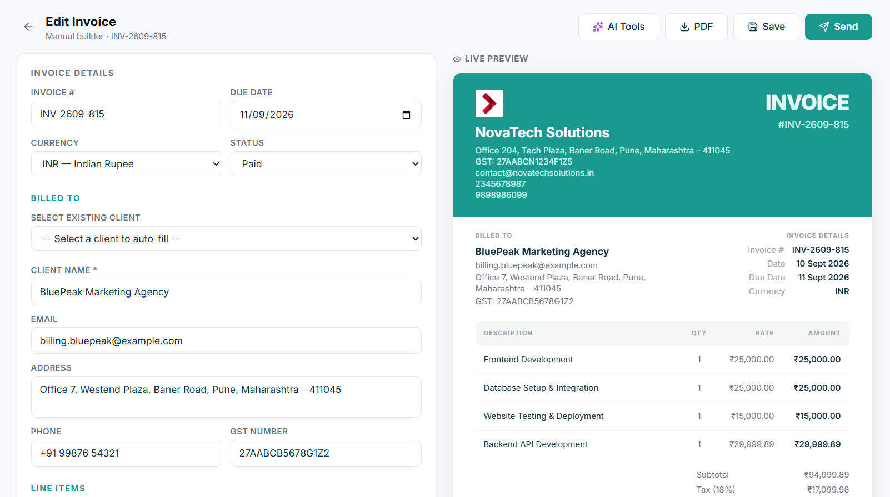

# InvoiceAI 🚀

An AI-powered invoicing web application that lets freelancers, small businesses, and independent professionals generate, manage, and export professional invoices using natural language prompts, alongside a traditional manual builder.

**Live Demo:** [https://invoice-ai-foryou.vercel.app/](https://invoice-ai-foryou.vercel.app/)

## 📸 UI Previews


<br>

<br>


## ✨ Key Features

- **AI Invoice Generation**: Type a plain-language description of the work and get a complete, editable invoice draft in seconds using the Gemini API.
- **Manual Invoice Builder**: A dynamic manual form with line items, tax percentage, discount, currency selector, and a live side-by-side preview.
- **AI Smart Assistant**: Includes a service description generator, payment terms suggester, notes generator, invoice validator, and an email draft generator.
- **Client & Invoice Management**: Full CRUD operations for clients and invoices. Search past clients, auto-fill details, filter invoices by status, and duplicate past invoices.
- **Business Profile**: Upload a custom logo and signature to automatically brand every generated invoice.
- **PDF Export**: Generate professional downloadable PDF invoices with an optional QR code.
- **Dashboard & Analytics**: Get a bird's-eye view of your total revenue, paid/pending invoices, and recent activity.
- **Authentication**: Secure Firebase Auth supporting Google Sign-In, Email/Password, and Guest Mode.

## 🛠 Tech Stack

**Frontend**
- React.js + Vite
- Tailwind CSS v3
- React Router
- React Hook Form
- Recharts (Dashboard analytics)
- Lucide React (Icons)
- React Hot Toast (Notifications)

**Backend & AI**
- Node.js + Express.js (Proxy API layer)
- Google Gemini API (Natural language processing)
- pdf-lib (PDF generation)

**Database & Cloud**
- Firebase Firestore (NoSQL Database)
- Firebase Storage (Logos, Signatures)
- Firebase Authentication

## 🚀 Local Development Setup

To run this project locally, you will need Node.js and Firebase configuration credentials.

### 1. Clone the repository
```bash
git clone https://github.com/Shriya-25/InvoiceAI.git
cd InvoiceAI
```

### 2. Backend Setup
```bash
cd backend
npm install
```
Create a `.env` file in the `backend` directory with your Gemini and Firebase credentials:
```env
PORT=5000
GEMINI_API_KEY=your_gemini_api_key
# Add your Firebase Admin SDK credentials or configuration here
```
Start the backend server:
```bash
npm run dev
```

### 3. Frontend Setup
Open a new terminal window:
```bash
cd frontend
npm install
```
Create a `.env` file in the `frontend` directory with your Firebase config:
```env
VITE_FIREBASE_API_KEY=your_api_key
VITE_FIREBASE_AUTH_DOMAIN=your_auth_domain
VITE_FIREBASE_PROJECT_ID=your_project_id
VITE_FIREBASE_STORAGE_BUCKET=your_storage_bucket
VITE_FIREBASE_MESSAGING_SENDER_ID=your_messaging_sender_id
VITE_FIREBASE_APP_ID=your_app_id
VITE_API_URL=http://localhost:5000/api
```
Start the frontend development server:
```bash
npm run dev
```

The app will be available at `http://localhost:5173`.
